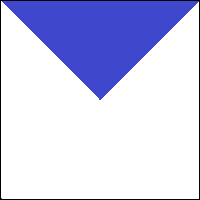
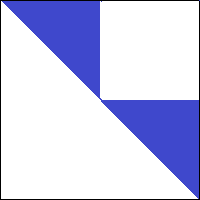

= Лабораторна робота №6

== Тема: Розробка програм з використанням складних типів даних: двовимірних масивів та рядків

Мета роботи: оволодіння навичками складання програм з використанням двовимірних масивів та рядків за допомогою засобів мови Kotlin .

== Завдання 6.1
Заповнити двовимірний масив згідно правила заданого рисунком

_Розмір масиву вводити з клавіатури. Всі елементи, що потрапляють до зафарбованої області дорівнюють 1, всі інші - дорівнюють 0_

Після заповнення, масив обов'язково вивести на екран

=== Варіант 1

=== Варіант 2

=== Варіант 3
image::pic/image003.png[]
=== Варіант 4

=== Варіант 5

=== Варіант 6

=== Варіант 7

=== Варіант 8

=== Варіант 9

=== Варіант 10

=== Варіант 11

=== Варіант 12

=== Варіант 13

=== Варіант 14

=== Варіант 15

=== Варіант 16

=== Варіант 17

=== Варіант 18

=== Варіант 19

=== Варіант 20

== Завдання 6.2
Згідно варіанту з завдання 6.1 знайти суму та середнє арифметичне значення елементів зафарбованої частини масиву ==
_Для виконання завдання попередньо заповнити масив випадковими цілими числами з проміжку від -50 до 50_
Результати обчислень вивести на екран

== Завдання 6.3
Скласти програму для виконання наступних дій і виконати її в середовищі програмування.
_У всіх завданнях вважати, що рядок може містити лише літери, цифри та знаки пробілу. Слово - послідовність символів, що не містить пробілів._

=== Варіанти 1-3
Визначення кількості слів у рядку

=== Варіанти 4-6
Вилучення усіх цифр в рядку

=== Варіанти 7-9
Інвертування символів у рядку

=== Варіанти 10-12
Визначення кількості цифр у рядку

=== Варіанти 13-15
Визначення слова з найменшою кількістю літер в рядку

=== Варіанти 16-18
Визначення кількості чисел у рядку

=== Варіанти 19-21
 Визначення слова з найбільшою кількістю літер у рядку

=== Варіанти 22-24
Заміна усіх великих букв в рядку на малі

=== Варіанти 25-27
Вилучення зайвих символів «пробіл» в рядку

=== Варіанти 28-30
Заміна усіх малих букв в рядку на великі

